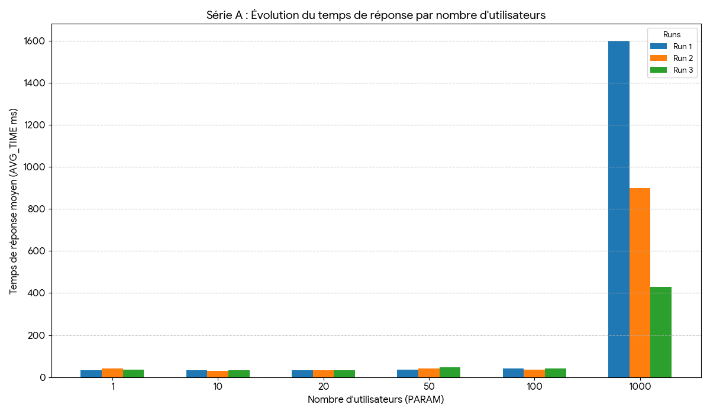
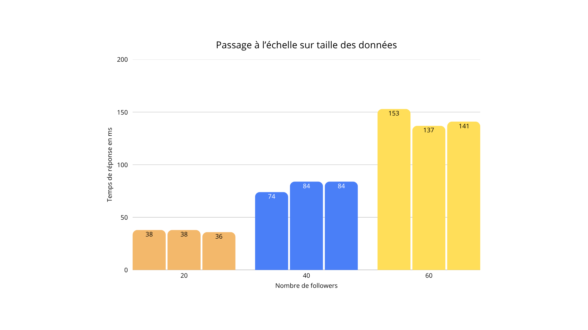

# Resultats du TP

**Partie 1 du TP**



Pour la première expérience concernant le passage à l'échelle sur la charge, les données du fichier conc.csv révèlent que
l'application TinyInsta dispose d'une scalabilité horizontale.

Durant les premiers paliers allant de un à cent utilisateurs simultanés, le temps de réponse reste extrêmement stable, oscillant entre trente et quarante-sept ms. 
Cette stabilité s'explique par la réactivité de Google App Engine qui ajuste le nombre d'instances de une à quatre pour absorber la demande.

Le moment le plus critique survient lors du passage à mille utilisateurs. Au premier run, le temps de réponse grimpe brutalement à mille six cents millisecondes 
car l'infrastructure subit un choc de charge alors qu'elle n'a pas encore assez de serveurs actifs. 
Cependant, dès le troisième run, ce temps chute à quatre cent trente millisecondes grâce au déploiement de vingt instances. 
Cela prouve que le système scale bien car il finit par stabiliser la latence en multipliant ses ressources. 
Nous sommes cependant limité à 20 instances sur google cloud, on peut donc pas scale au dessus de cette limite.

**Partie 2 du TP**




Concernant la seconde expérience sur la taille des données détaillée dans le fichier fanout.csv, les résultats montrent une moins bonne de l'application à la complexité des requêtes. 
Malgré le triplement du nombre d'abonnés, passant de vingt à soixante follows, le temps moyen de réponse double de manière significative et se maintient aux alentours de 80 millisecondes. 
L'infrastructure compense le léger surcroît de travail processeur en maintenant quatre instances actives au lieu des trois habituelles pour cette charge. 
On en peut ici pas ainsi dire que l'application scale.


**Conclusion**

En conclusion, l'application TinyInsta remplit les objectifs de scalabilité fixés par le TP. 
L'élasticité du modèle Paas permet de répondre à une augmentation massive du nombre d'utilisateurs tandis que l'utilisation d'une base de données NoSQL gérée garantit des performances constantes malgré la croissance des relations entre les utilisateurs. 
Les seules limites identifiées concernent le temps de préchauffage des instances lors d'un pic soudain et le rejet de certaines requêtes pour protéger l'intégrité des serveurs.

# Tiny Instagram (minimal) on Google App Engine

This repository contains a tiny Instagram-like demo implemented with Flask and Google Cloud Datastore (Firestore in Datastore mode). It is a small, educational project that demonstrates posting, following, and reading a simple timeline.

This README describes how to run, seed and test the app, plus notes about GQL queries and common deployment troubleshooting.

## Prerequisites
- Create a GCP Project:`https://console.cloud.google.com/`
  - See the prof.

- Open a cloud shell 
  - see the prof.

* Initialize or select your GCP project and create the App Engine application (if not already created):

```sh
gcloud init
gcloud app create
```

- clone the prof github repository : 
```
git clone https://github.com/momo54/massive-gcp
cd massive-gcp
```

* Install dependencies
```sh
pip install -r requirements.txt
```

* Deploy the app:

```sh
gcloud app deploy
```

* [OPTIONAL] Index does not matter:

```sh
gcloud app deploy index.yaml
# or
gcloud datastore indexes create index.yaml
```

* open the URL address of the you application, create account, post, follow. Does it Works?? If something is wrong where to find the error ?? 
  * See the prof


* How many servers are working for this app?? How much are you paying for running this app ? What is the cloud model for this app (Iaas, Paas, Saas). What is the Platform in PaaS ??

Il y a entre 1 et 20 serveurs selon la charge (vu grâce à la commande gcloud app instances list)
Le modèle Cloud c'est du Paas avec Google App engine qui est la platform et qui fournit python, la gestion des serveurs etc.


* See the impact in the datastore: do you see your data ?
  * See the prof

* How much are you paying for hosting these data in this store ?? 
* What is the consistency of this store ?

Il y a 2 types de consistances, sois pour toutes les requêtes ou alors uniquement pour les clés d'accès.

* What is the sharding strategy of this store ? How to be sure of that ? 

Datastore utilise un partitionnement automatique par plages de clés.
On s'en rend compte car nous n'avons pas à définir de clés de partition manuellement.

* What queries can you write with store (expressivity)* What is the consistency of this store ?

On peut faire des requêtes qui filtrent avec des = , > , < ou avec du tri (order by).
Cependant, on ne peut pas faire de joins ou d'agrégations complexes notamment avec des SUM/AVG.

## HTTP Endpoints

- `/` — HTML UI for simple interactions
- `POST /login` — login with a username (no password)
- `POST /post` — create a new post (form)
- `POST /follow` — follow another user (form)
- `GET /api/timeline?user=<username>&limit=<n>` — JSON timeline for a user (default limit 20)
- `POST /admin/seed` — server-side seed (requires `SEED_TOKEN` via header `X-Seed-Token` or `token` param)

Example server-side seed call:

```sh
curl -X POST \
  -H "X-Seed-Token: change-me-seed-token" \
  "https://<YOUR_APP>.appspot.com/admin/seed?users=8&posts=100&follows_min=1&follows_max=4&prefix=load"
```

## Access the backend from the CLI

The JSON endpoint `GET /api/timeline?user=<username>&limit=20` is suitable for basic load experiments.

- Run locally against the dev server:

```sh
ab -n 200 -c 20 "http://127.0.0.1:8080/api/timeline?user=demo1&limit=20"
```

- Run against the deployed app (no cookie):

```sh
ab -n 500 -c 50 "https://<YOUR_APP>.appspot.com/api/timeline?user=demo1&limit=20"
```

- Optional: include a session cookie if you want to test authenticated flows (get `session` cookie from your browser devtools):

```sh
AB_COOKIE="session=<VALUE>"
ab -n 500 -c 50 -H "Cookie: $AB_COOKIE" "https://<YOUR_APP>.appspot.com/api/timeline?limit=20"
```

Interpreting common metrics:
- `Requests per second` — throughput
- `Time per request` — latency
- `Failed requests` — should remain near 0 for a healthy run

## GQL & Datastore notes

The timeline query used by the app is roughly:

```sql
SELECT * FROM Post WHERE author IN @authors ORDER BY created DESC
```

Notes:
- `IN` queries are conceptually implemented as a union of per-author scans followed by a k-way merge ordered by `created DESC`.
- The repository includes `index.yaml` with a composite index (author + created desc), which is required for efficient execution of the timeline query.
- Writes use the Datastore entity API; GQL is used for convenient reads only.

Limitations and trade-offs:
- `IN` with many values increases work and latency because it becomes multiple queries merged server-side.
- Global queries are eventually consistent; only key lookups and ancestor queries are strongly consistent. See `NOTES.md` for more detail.

## Troubleshooting: Cloud Build / staging bucket error

If you encounter an error like:

```
Failed to create cloud build: ... invalid bucket "staging.<PROJECT>.appspot.com"; service account ... does not have access
```

Check the following:

1. Required services are enabled:

```sh
gcloud services enable appengine.googleapis.com cloudbuild.googleapis.com iam.googleapis.com storage.googleapis.com
```

2. Ensure the App Engine service account has sufficient permissions on the staging bucket. For example, grant storage admin at project level (adjust to least privilege required):

```sh
PROJECT_ID="<YOUR_PROJECT>"
gcloud projects add-iam-policy-binding "$PROJECT_ID" \
  --member="serviceAccount:${PROJECT_ID}@appspot.gserviceaccount.com" \
  --role="roles/storage.admin"
```

3. If the staging bucket is missing, create it and grant the service account object admin on the bucket:

```sh
gsutil mb -p "$PROJECT_ID" -l europe-west1 "gs://staging.${PROJECT_ID}.appspot.com"
gsutil iam ch serviceAccount:${PROJECT_ID}@appspot.gserviceaccount.com:objectAdmin "gs://staging.${PROJECT_ID}.appspot.com"
```

Index deployment (if GCP prompts for missing indexes):

```sh
gcloud datastore indexes create index.yaml || gcloud app deploy index.yaml
```

## Notes on consistency, partitioning and CAP
See `NOTES.md` for a concise explanation of Datastore's partitioning (range partitioning with dynamic splits), replication, and its consistency model (generally AP for global queries; strong consistency for key lookups and ancestor queries).

## License
MIT

```
